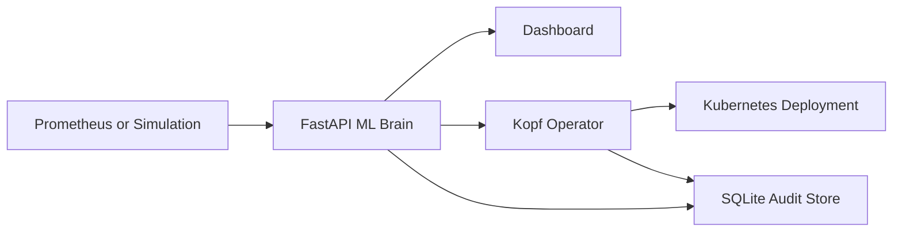

# RightSize AI

Predictive Kubernetes autoscaling with explainable recommendations, safety guardrails, and cost visibility.

RightSize AI forecasts CPU demand, recommends safer CPU limits, and can apply those recommendations through a guarded Kubernetes operator. The dashboard is built for demos: it shows live/simulated CPU, forecasted CPU, confidence, explanation, estimated savings, scaling history, and operator decisions in one place.

## Why It Matters

Static CPU limits waste money. Reactive autoscalers wait until load has already changed. RightSize AI predicts demand before the spike, then applies guardrails before changing anything.

Core pitch:

- Predict demand before it happens.
- Explain every recommendation.
- Apply safe scaling with cooldowns, min/max CPU bounds, and change thresholds.
- Translate saved CPU into estimated monthly savings.

## Architecture



## Features

- Prophet-based CPU forecasting
- Cached model training with configurable TTL
- Real confidence score from forecast uncertainty
- Human-readable explanations
- Multi-pod Prometheus aggregation
- Simulation mode for reliable demos
- One-page dashboard at `/dashboard`
- Trigger CPU spike button
- Enable/disable autoscaling controls
- Apply recommendation button
- SQLite persistence for predictions, scaling actions, deployment configs, and operator decisions
- Kubernetes operator with cooldown, confidence gate, min/max CPU, and change threshold
- Dockerfiles and Compose setup

## Quick Demo: Dashboard Only

This is the fastest way to present the project. Docker and Minikube are not required.

```powershell
cd C:\RightSize
$env:RIGHTSIZE_SIMULATION_MODE="true"
.\venv\Scripts\python.exe -m uvicorn ml_engine:app --reload --host 127.0.0.1 --port 8000
```

Open:

```text
http://127.0.0.1:8000/dashboard
```

Keep simulation mode checked. Use these buttons during the demo:

1. Trigger CPU spike
2. Refresh now
3. Apply recommendation
4. Enable autoscaling

Also show the API docs:

```text
http://127.0.0.1:8000/docs
```

## Full Kubernetes Demo

Start Docker Desktop first.

```powershell
cd C:\RightSize
.\minikube.exe start --driver=docker
.\minikube.exe update-context
kubectl config use-context minikube
kubectl get nodes
```

Create or reset the demo deployment:

```powershell
kubectl get deployment demo-app
kubectl create deployment demo-app --image=nginx
kubectl set resources deployment demo-app --requests=cpu=500m --limits=cpu=1000m
```

If `demo-app` already exists, ignore the create error and run the `kubectl set resources` command.

Enable RightSize annotations:

```powershell
kubectl annotate deployment demo-app rightsize.ai/enabled="true" --overwrite
kubectl annotate deployment demo-app rightsize.ai/mode="auto" --overwrite
kubectl annotate deployment demo-app rightsize.ai/min-cpu="100m" --overwrite
kubectl annotate deployment demo-app rightsize.ai/max-cpu="2000m" --overwrite
kubectl annotate deployment demo-app rightsize.ai/cooldown-seconds="60" --overwrite
kubectl annotate deployment demo-app rightsize.ai/change-threshold-percent="5" --overwrite
```

Terminal 1:

```powershell
cd C:\RightSize
$env:RIGHTSIZE_SIMULATION_MODE="true"
.\venv\Scripts\python.exe -m uvicorn ml_engine:app --reload --host 127.0.0.1 --port 8000
```

Terminal 2:

```powershell
cd C:\RightSize
$env:RIGHTSIZE_MIN_CONFIDENCE="0.50"
.\venv\Scripts\python.exe -m kopf run k8s_operator.py --namespace default --verbose
```

Check CPU limit:

```powershell
kubectl get deployment demo-app -o=jsonpath="{.spec.template.spec.containers[0].resources.limits.cpu}"
```

## Docker Compose

Backend dashboard only:

```powershell
docker compose up --build rightsize-backend
```

Open:

```text
http://127.0.0.1:8000/dashboard
```

Operator profile:

```powershell
docker compose --profile operator up --build
```

The operator profile mounts your local kubeconfig and expects the `minikube` context to work.

## API Endpoints

- `GET /dashboard`
- `GET /predict`
- `GET /metrics`
- `GET /cost-estimate`
- `GET /prediction-history`
- `GET /scaling-history`
- `GET /operator-decisions`
- `GET /deployments`
- `POST /simulate/spike`
- `POST /autoscaling/enable`
- `POST /autoscaling/disable`
- `POST /apply-recommendation`

## Demo Script

Use this flow:

1. Open the dashboard.
2. Say: "RightSize AI predicts Kubernetes CPU demand before the spike happens."
3. Point to current CPU, recommended CPU, confidence, and explanation.
4. Click "Trigger CPU spike."
5. Show the forecast and explanation update.
6. Click "Apply recommendation."
7. Show scaling history and operator decisions.
8. Open `/docs` to prove the dashboard is backed by APIs.

If Kubernetes is running, also show the operator logs and the `kubectl get deployment` CPU limit.

## Safety Guardrails

The operator does not blindly apply ML output. It checks:

- Confidence threshold
- Cooldown period
- Minimum CPU
- Maximum CPU
- Change threshold
- Recommendation mode vs auto mode

Every decision is written to SQLite, including skipped actions.

## Environment Variables

| Variable | Default | Purpose |
| --- | --- | --- |
| `RIGHTSIZE_SIMULATION_MODE` | `false` | Uses synthetic CPU data instead of Prometheus |
| `RIGHTSIZE_MODEL_TTL_SECONDS` | `600` | Model cache duration |
| `RIGHTSIZE_CPU_HOUR_COST_INR` | `3.5` | Cost estimate rate |
| `PROMETHEUS_URL` | `http://localhost:9090` | Prometheus source |
| `RIGHTSIZE_DB_FILE` | `rightsize.db` | SQLite database path |
| `RIGHTSIZE_MIN_CONFIDENCE` | `0.80` | Operator confidence gate |
| `RIGHTSIZE_COOLDOWN_SECONDS` | `300` | Default operator cooldown |

## Stop Everything

Stop FastAPI or Kopf with `Ctrl + C`.

Stop Minikube:

```powershell
.\minikube.exe stop
```

Stop Docker Compose:

```powershell
docker compose down
```

## Roadmap

- Memory and latency recommendations
- Namespace-level cost reports
- Helm chart
- Backtesting accuracy report
- In-cluster backend/operator deployment manifests
- Authentication for dashboard actions
