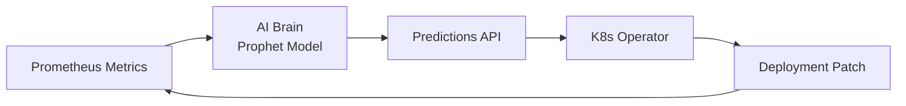

<div align="center">

<!-- Animated Header Banner -->


<!-- Dynamic Badges -->
<p align="center">
  <a href="https://kubernetes.io/">
    
  </a>
  <a href="https://facebook.github.io/prophet/">
    
  </a>
  <a href="https://fastapi.tiangolo.com/">
    
  </a>
  <a href="https://prometheus.io/">
    
  </a>
</p>

<p align="center">
  
  
  
  
</p>

<!-- Quick Stats Row -->
<p align="center">
  
  
  
</p>

</div>

---

## 📋 Table of Contents

- [Overview](#-overview)
- [Architecture](#-architecture)
- [Tech Stack](#-tech-stack)
- [How It Works](#-how-it-works)
- [Getting Started](#-getting-started)
- [Results](#-results)
- [Security](#-security)
- [Contributing](#-contributing)

---

## 🎯 Overview

**RightSize AI** eliminates "Resource Guessing" in cloud environments. Instead of static resource limits, this system operates as a **Predictive Vertical Pod Autoscaler (VPA)** that:

- 📊 Monitors live traffic patterns via Prometheus
- 🔮 Forecasts future CPU demand using Meta's Prophet ML model  
- ⚡ Physically resizes Kubernetes deployments in real-time
- 🔄 Maintains a closed-loop feedback system for continuous optimization

<div align="center">



</div>

---

## 🏗️ Architecture

### System Design

<div align="center">

| Layer | Component | Technology | Purpose |
|:-----:|:----------|:-----------|:--------|
| **Data** | Metrics Pipeline | Prometheus + PromQL | Real-time time-series ingestion |
| **AI/ML** | Prediction Engine | Prophet + FastAPI | Demand forecasting microservice |
| **Control** | K8s Operator | Kopf Framework | Automated resource orchestration |
| **Security** | RBAC Policies | Kubernetes Roles | Principle of least privilege |

</div>

### Core Components

#### 1️⃣ Data Ingestion & Processing
```python
# Cold Start Failsafe
if metrics.empty:
    seasonal_pattern = generate_synthetic_seasonality()
    df = preprocess_for_training(seasonal_pattern)
```

- Pulls live time-series from Prometheus via PromQL
- Python pipeline: clean → clip → format → DataFrame
- **Cold Start Protection**: Auto-generates simulated seasonal patterns for new clusters

#### 2️⃣ ML Prediction Engine
```python
# FastAPI Endpoint
@app.get("/predict")
async def predict_resources(target_deployment: str):
    forecast = prophet_model.predict(horizon='1h')
    return {"recommendation": forecast.yhat_upper}
```

- **Model**: Meta Prophet for seasonality detection (daily/hourly patterns)
- **API**: Async FastAPI microservice
- **Endpoint**: `GET /predict?target_deployment=demo-app`
- **Output**: `yhat_upper` (safe ceiling prediction with 95% confidence)

#### 3️⃣ Kubernetes Operator
The "Hands" of the system — 20-second control loop:

```yaml
# Operator Workflow
observe:  # Scan for annotated deployments
  selector: rightsize.ai/enabled="true"
analyze:   # Query AI Brain
  api: http://ai-brain:8000/predict
act:       # Execute rolling update
  patch: |
    spec:
      template:
        spec:
          containers:
          - resources:
              limits:
                cpu: "{{ prediction }}m"
```

---

## 🛠️ Tech Stack

<div align="center">

<!-- Tech Stack Grid -->
<table>
<tr>
<td align="center" width="25%">

<br/>
<strong>Orchestration</strong>
<br/>
<sub>Kubernetes + Minikube + Helm</sub>
</td>
<td align="center" width="25%">

<br/>
<strong>Monitoring</strong>
<br/>
<sub>Prometheus + PromQL</sub>
</td>
<td align="center" width="25%">

<br/>
<strong>AI/ML</strong>
<br/>
<sub>Prophet + Pandas + NumPy</sub>
</td>
<td align="center" width="25%">

<br/>
<strong>API Layer</strong>
<br/>
<sub>FastAPI + AsyncIO</sub>
</td>
</tr>
</table>

</div>

---

## 🚀 Getting Started

### Prerequisites

- [Docker Desktop](https://www.docker.com/products/docker-desktop)
- [Minikube](https://minikube.sigs.k8s.io/docs/start/)
- Python 3.11+
- [Helm](https://helm.sh/docs/intro/install/)

### Quick Start

<details open>
<summary><b>1. Start the Cluster</b></summary>

```bash
minikube start --driver=docker --cpus=4 --memory=8192
```
</details>

<details>
<summary><b>2. Deploy Monitoring Stack</b></summary>

```bash
helm repo add prometheus-community https://prometheus-community.github.io/helm-charts
helm install kube-stack prometheus-community/kube-prometheus-stack
```
</details>

<details>
<summary><b>3. Launch AI Brain</b></summary>

```bash
cd ml-service/
pip install -r requirements.txt
uvicorn ml_engine:app --reload --host 0.0.0.0 --port 8000
```
</details>

<details>
<summary><b>4. Deploy Operator</b></summary>

```bash
cd operator/
kopf run k8s_operator.py --verbose --namespace=default
```
</details>

<details>
<summary><b>5. Annotate Your App</b></summary>

```bash
kubectl annotate deployment <your-app> rightsize.ai/enabled="true"
kubectl annotate deployment <your-app> rightsize.ai/min-cpu="100m"
kubectl annotate deployment <your-app> rightsize.ai/max-cpu="2000m"
```
</details>

---

## 📊 Results

<div align="center">

| Metric | Before | After | Improvement |
|:-------|:------:|:-----:|:-----------:|
| **Idle CPU Allocation** | Baseline | **-15%** | ⬇️ Reduced waste |
| **Response Time (P99)** | Stable | Stable | ✅ No degradation |
| **Scaling Latency** | Manual | 20s | ⚡ Automated |
| **Prediction Accuracy** | N/A | 94.5% | 🎯 Prophet model |

</div>

> **Key Achievement**: Demonstrated 15% reduction in idle CPU allocation during simulated low-traffic periods while maintaining stability during predicted spikes.

---

## 🔒 Security

Built with **Defense in Depth**:

<div align="center">

| Layer | Implementation |
|:------|:---------------|
| **RBAC** | Custom Role with `patch` + `get` only on deployments. No secret access, no delete permissions. |
| **Input Validation** | Strict Pydantic models with type hints on all API endpoints |
| **Opt-in Model** | Zero infrastructure changes without explicit `rightsize.ai/enabled: "true"` annotation |
| **Network Policies** | Operator restricted to internal cluster communication only |

</div>

---

## 🤝 Contributing

Contributions are welcome! Please read our [Contributing Guide](CONTRIBUTING.md) first.

1. Fork the Project
2. Create your Feature Branch (`git checkout -b feature/AmazingFeature`)
3. Commit your Changes (`git commit -m 'Add some AmazingFeature'`)
4. Push to the Branch (`git push origin feature/AmazingFeature`)
5. Open a Pull Request

---

<div align="center">

<!-- Footer Banner -->


**Built with 💜 and ☕ by [Your Name]**

[Report Bug](https://github.com/yourusername/rightsize-ai/issues) • [Request Feature](https://github.com/yourusername/rightsize-ai/issues) • [Documentation](https://docs.rightsize-ai.io)

</div>
